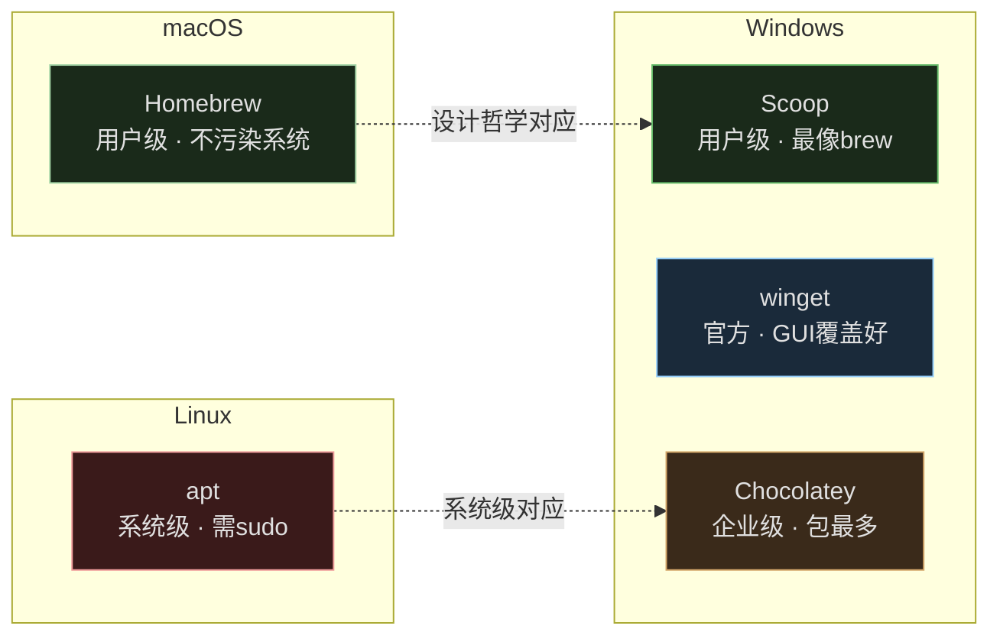
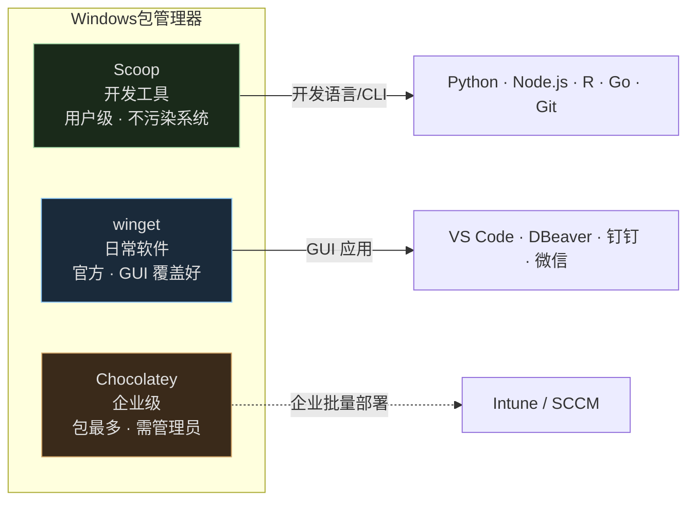
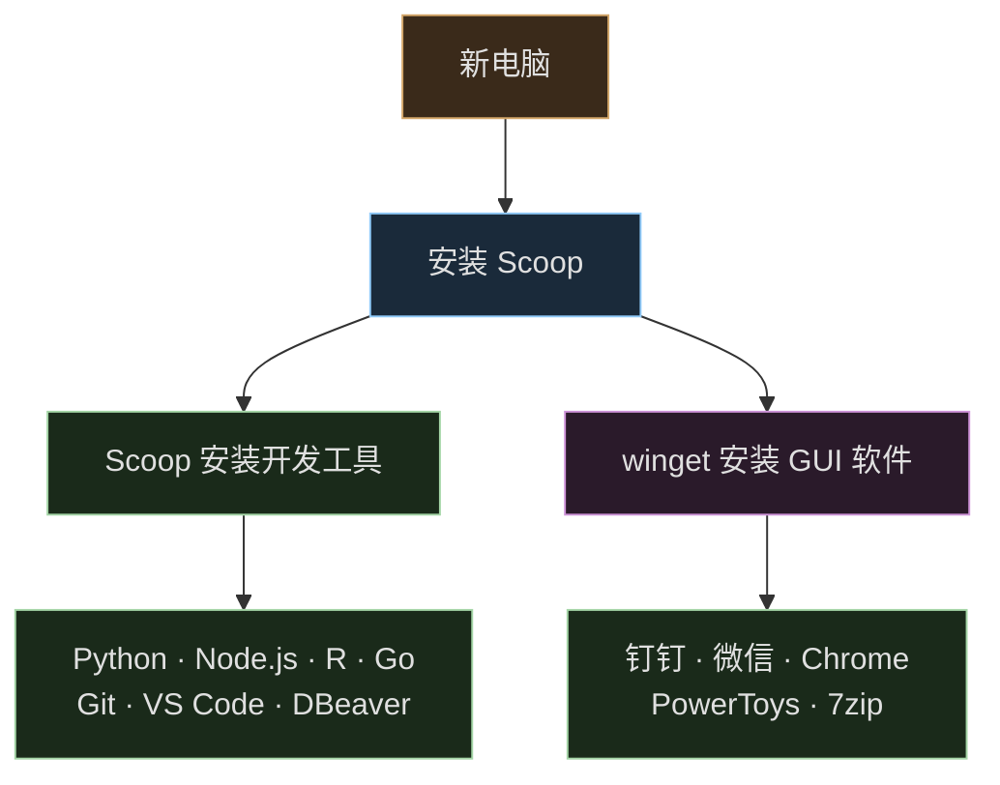
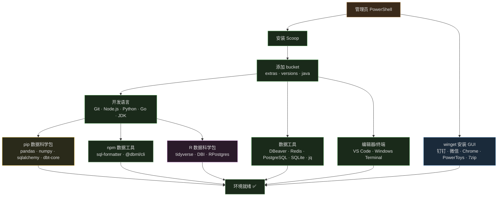
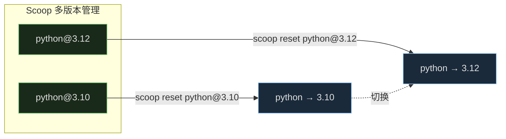
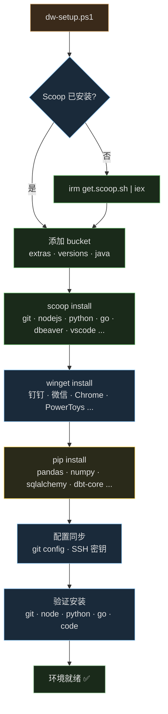
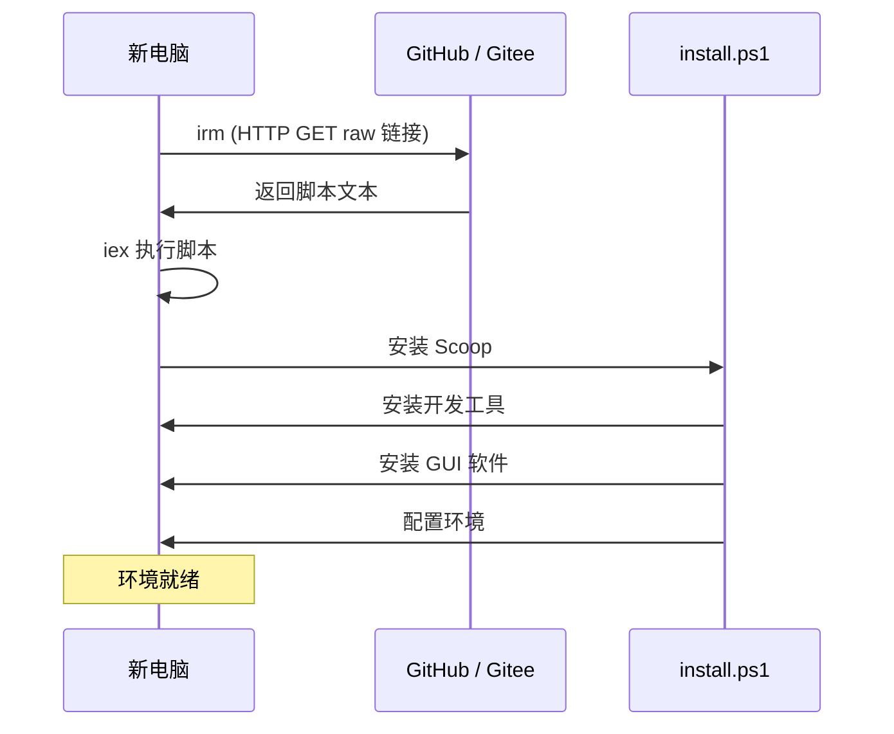
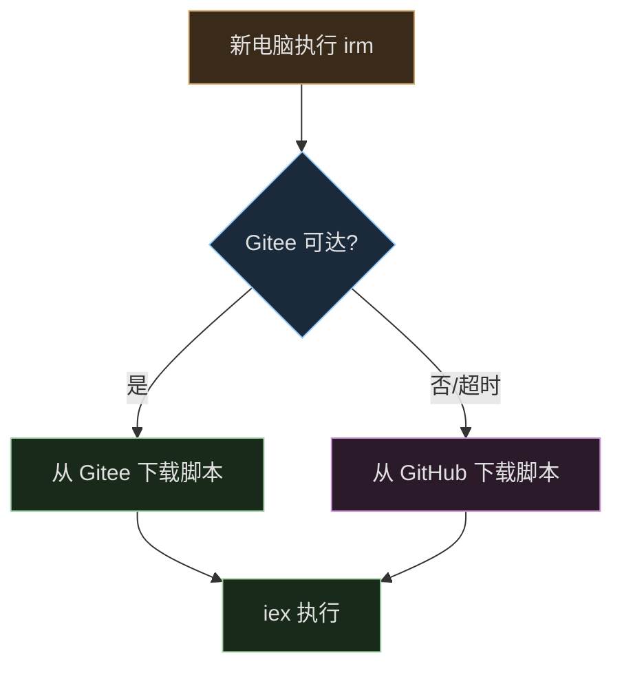

# Windows 开发环境一键配置

数据仓库团队新电脑初始化方案：Scoop + winget 组合安装开发工具与日常软件，PowerShell 脚本实现一行命令批量部署。

## 包管理器对比



### Linux / macOS / Windows 全平台

| 操作 | apt (Debian/Ubuntu) | Homebrew (macOS) | choco | winget | Scoop |
|------|---------------------|------------------|-------|--------|-------|
| 安装 | `apt install` | `brew install` | `choco install` | `winget install` | `scoop install` |
| 卸载 | `apt remove` | `brew uninstall` | `choco uninstall` | `winget uninstall` | `scoop uninstall` |
| 更新索引 | `apt update` | `brew update` | — | `winget source update` | `scoop update` |
| 升级全部 | `apt upgrade` | `brew upgrade` | `choco upgrade all` | `winget upgrade --all` | `scoop update *` |
| 搜索 | `apt search` | `brew search` | `choco search` | `winget search` | `scoop search` |
| 需要 sudo | ✅ | ❌ | ✅ | 部分 | ❌ |

### Windows 三大包管理器

| 工具 | 定位 | 权限 | 安装位置 | 卸载干净度 |
|------|------|------|---------|-----------|
| **Scoop** | 开发者友好，最像 brew | 不需要管理员 | `~/scoop` 统一 | 非常干净 |
| **winget** | 微软官方 | 部分需要 | 系统默认 | 一般 |
| **Chocolatey** | 社区驱动，包最多 | 需要管理员 | 分散（Program Files 等） | 有时残留 |



## 推荐方案：Scoop + winget

| 工具 | 负责范围 | 为什么 |
|------|---------|--------|
| **Scoop** | 开发环境（Git、Node、Python、Go、R、VS Code 等） | 用户级、多版本共存、卸载干净 |
| **winget** | 日常软件（钉钉、微信、Chrome、DBeaver 等） | 微软官方、GUI 软件覆盖好 |



### 为什么不全用 Chocolatey？

| | Scoop + winget | 全用 Chocolatey |
|--|---------------|-----------------|
| 权限 | 大部分不需要管理员 | 经常需要管理员 |
| 安装位置 | 统一、干净 | 分散在 Program Files |
| 卸载 | 非常干净 | 有时残留 |
| 开发体验 | 多版本切换方便 | 较弱 |
| 日常软件覆盖 | winget 足够 | 更多，但没必要 |

Chocolatey 适合企业批量部署，个人开发环境 Scoop 更清爽。

## 数据仓库开发环境配置脚本



### 安装 Scoop

```powershell
# 管理员 PowerShell（只此一次，后续装软件都不需要管理员）
Set-ExecutionPolicy -ExecutionPolicy RemoteSigned -Scope CurrentUser
irm get.scoop.sh | iex
```

### Scoop 安装开发工具

```powershell
# 添加必要仓库
scoop bucket add extras
scoop bucket add versions
scoop bucket add java

# 开发语言
scoop install git
scoop install nodejs           # Node.js + npm
scoop install python           # Python
scoop install go               # Go
scoop install openjdk          # Java（部分数据工具需要）

# 数据工具
scoop install dbeaver          # 数据库管理
scoop install redis
scoop install postgresql
scoop install sqlite
scoop install jq               # JSON 处理

# 编辑器/终端
scoop install vscode
scoop install windows-terminal
```

### winget 安装日常软件

```powershell
# 办公通讯
winget install DingTalk.DingTalk --accept-source-agreements --accept-package-agreements
winget install Tencent.WeChat --accept-source-agreements --accept-package-agreements

# 浏览器/工具
winget install Google.Chrome --accept-source-agreements --accept-package-agreements
winget install Microsoft.PowerToys --accept-source-agreements --accept-package-agreements
winget install 7zip.7zip --accept-source-agreements --accept-package-agreements

# 数据库 GUI
winget install DBeaver.DBeaverCommunity --accept-source-agreements --accept-package-agreements
```

### Python / Node.js / R 数据科学包

```powershell
# Python 数据科学
pip install pandas numpy sqlalchemy psycopg2-binary pymysql jupyterlab pyarrow dbt-core

# Node.js 数据工具
npm install -g sql-formatter @dbml/cli

# R 数据科学
Rscript -e "install.packages(c('tidyverse', 'DBI', 'RPostgres', 'data.table'), repos='https://cran.r-project.org')"
```

### Scoop 多版本共存



```powershell
# 安装多版本
scoop install python@3.10
scoop install python@3.12

# 切换版本
scoop reset python@3.10
```

所有软件装在 `~/scoop`，搬家时直接复制文件夹即可。

## 一键脚本



### 完整版 `dw-setup.ps1`

```powershell
# 数据仓库开发环境一键配置脚本
# 运行: 管理员 PowerShell → .\dw-setup.ps1

param(
    [switch]$SkipScoop,
    [switch]$SkipWinget,
    [switch]$SkipConfig
)

Write-Host "数据仓库开发环境配置开始..." -ForegroundColor Cyan

# --- 1. 安装 Scoop ---
if (-not $SkipScoop) {
    if (-not (Get-Command scoop -ErrorAction SilentlyContinue)) {
        Set-ExecutionPolicy -ExecutionPolicy RemoteSigned -Scope CurrentUser -Force
        irm get.scoop.sh | iex
    }

    scoop bucket add extras
    scoop bucket add versions
    scoop bucket add java

    # 开发语言
    $devTools = @("git", "nodejs", "python", "go", "openjdk", "dbeaver", "vscode", "windows-terminal", "redis", "postgresql", "sqlite", "jq")
    foreach ($tool in $devTools) {
        scoop install $tool
    }
}

# --- 2. winget 安装 GUI 软件 ---
if (-not $SkipWinget) {
    $apps = @(
        "DingTalk.DingTalk",
        "Tencent.WeChat",
        "Google.Chrome",
        "Microsoft.PowerToys",
        "7zip.7zip",
        "DBeaver.DBeaverCommunity"
    )
    foreach ($app in $apps) {
        winget install $app --accept-source-agreements --accept-package-agreements --silent
    }
}

# --- 3. Python 数据科学包 ---
python -m pip install --upgrade pip
$pyPackages = @("pandas", "numpy", "sqlalchemy", "psycopg2-binary", "pymysql", "jupyterlab", "pyarrow", "dbt-core")
foreach ($pkg in $pyPackages) {
    pip install $pkg
}

# --- 4. 配置同步 ---
if (-not $SkipConfig) {
    git config --global init.defaultBranch main
    git config --global core.autocrlf true

    if (-not (Test-Path "$env:USERPROFILE\.ssh\id_ed25519")) {
        ssh-keygen -t ed25519 -f "$env:USERPROFILE\.ssh\id_ed25519" -N '""'
    }
}

# --- 5. 验证安装 ---
Write-Host "`n验证安装..." -ForegroundColor Cyan
$checks = @("git --version", "node --version", "python --version", "go version", "code --version")
foreach ($cmd in $checks) {
    try {
        $result = Invoke-Expression $cmd
        Write-Host "  OK: $result" -ForegroundColor Green
    } catch {
        Write-Host "  FAIL: $cmd" -ForegroundColor Red
    }
}

Write-Host "`n配置完成！请重启终端使环境变量生效。" -ForegroundColor Green
```

### 仓库结构

```
dw-dev-setup/
├── install.ps1                # 主脚本
├── configs/
│   ├── vscode-settings.json   # VS Code 统一配置
│   ├── dbeaver-drivers/       # 数据库驱动配置
│   └── .gitconfig             # Git 配置模板
├── packages/
│   ├── python-requirements.txt
│   └── r-packages.R
└── README.md
```

## 多台电脑批量部署

### 方式一：irm 远程执行（推荐）

```powershell
# 一行命令，直接远程执行脚本，无需先下载
irm https://raw.githubusercontent.com/你的用户名/dw-dev-setup/main/install.ps1 | iex
```

`irm`（Invoke-RestMethod）从 URL 获取脚本内容，`iex`（Invoke-Expression）直接执行：



### 方式二：git clone 后执行

```powershell
git clone https://github.com/你的用户名/dw-dev-setup.git C:\tools\dw-setup
cd C:\tools\dw-setup
.\install.ps1
```

### 对比


| 方式 | 命令 | 适用场景 |
|------|------|---------|
| **irm + iex** | `irm ... \| iex` | 快速执行，不保留仓库文件 |
| **git clone** | `git clone ... && .\install.ps1` | 需要保留配置、后续更新 |

推荐组合：先 irm 快速安装 git，再 clone 仓库保留配置。

## 国内平台：Gitee

GitHub 国内访问不稳定时，用 Gitee 托管脚本：

| 平台 | Raw 链接格式 |
|------|-------------|
| **GitHub** | `https://raw.githubusercontent.com/用户名/仓库名/分支/文件路径` |
| **Gitee** | `https://gitee.com/用户名/仓库名/raw/分支/文件路径` |

```powershell
# Gitee 国内版（推荐）
irm https://gitee.com/你的用户名/dw-dev-setup/raw/main/install.ps1 | iex
```

### 自动切换（Gitee 主 + GitHub 备）

```powershell
$primaryUrl = "https://gitee.com/你的团队/dw-dev-setup/raw/main/install.ps1"
$backupUrl = "https://raw.githubusercontent.com/你的团队/dw-dev-setup/main/install.ps1"

try {
    irm $primaryUrl -TimeoutSec 10 | iex
} catch {
    Write-Host "Gitee 失败，尝试 GitHub..." -ForegroundColor Yellow
    irm $backupUrl | iex
}
```



## GitHub 参考项目

### 1. [Microsoft/WindowsDeveloperConfig](https://github.com/microsoft/WindowsDeveloperConfig)

微软官方出品，声明式配置，CI 测试，支持 `winget configure`：

```powershell
winget configure --enable
winget configure -f .\dev-config.winget --accept-configuration-agreements
```

适用：想要官方背书、企业级稳定性的场景。

### 2. [hoangatg/dev-setup-windows](https://github.com/hoangatg/dev-setup-windows)

80+ 工具，包含 AI 编程工具（Copilot、Claude Code、Gemini CLI），支持 WSL2、Dev Drive：

```powershell
irm https://raw.githubusercontent.com/hoangatg/dev-setup-windows/main/scripts/setup-all.ps1 | iex
```

适用：追求最新工具链、需要 AI 开发环境的个人开发者。

### 3. [DotDev262/WinHome](https://github.com/DotDev262/WinHome)

C# + .NET 10 编写，声明式 YAML 配置，支持多包管理器（winget + scoop），dotfiles 同步，注册表修改，WSL 配置：

```yaml
version: "1.0"
apps:
  - id: "Microsoft.PowerToys"
    manager: "winget"
  - id: "neovim"
    manager: "scoop"
dotfiles:
  - src: "./files/.gitconfig"
    target: "~/.gitconfig"
```

适用：喜欢 IaC 理念、需要精细控制配置的团队。

### 4. [progre/winget-bundle](https://github.com/progre/winget-bundle)

受 Homebrew `Brewfile` 启发，单一 `Bundlefile` 声明 winget + scoop 混合软件包，支持状态追踪和智能升级：

```ruby
winget "Microsoft.VisualStudioCode"
winget "Google.Chrome"
scoop "neovim"
scoop "fzf"
```

适用：习惯 Brewfile 工作流的开发者。

### 5. [felixlazy/dotfiles](https://github.com/felixlazy/dotfiles)

Windows + macOS + Linux 三平台统一，用 chezmoi 管理配置，Scoop 装 Windows 包：

```powershell
.\setup.ps1        # 安装 Scoop 包
chezmoi init --apply https://github.com/felixlazy/dotfiles.git
```

适用：多平台切换、需要统一配置体验的开发者。

### 6. [Matalus/dotfiles](https://github.com/Matalus/dotfiles)

纯 Scoop 方案，包含 PowerShell 定制、neovim、Windows Terminal、Nerd Fonts 等完整配置：

```powershell
.\install.ps1
```

适用：喜欢 Scoop 生态、追求终端美化的开发者。

### 7. [forzayt/CHOCOLATEY](https://github.com/forzayt/CHOCOLATEY)

Chocolatey 开发工作站批量配置，大量软件包清单，包含数据库工具（DBeaver、MySQL Workbench、Redis 等）：

```powershell
choco install dbeaver
choco install postgresql
choco install nodejs
choco install vscode
```

适用：快速复制软件清单、使用 Chocolatey 的场景。

### 8. Gist 快速脚本

单文件 PowerShell 脚本，自动安装 Scoop + Chocolatey + winget，然后批量装软件：

- [mikepruett3 的 Gist](https://gist.github.com/mikepruett3/7ca6518051383ee14f9cf8ae63ba18a7)
- [RubenZagon 的 Gist](https://gist.github.com/RubenZagon/1d4931f2547757c3d5ddce75f6b65378)

适用：快速上手、不想维护仓库的临时场景。

### 选择建议

| 你的需求 | 推荐项目 |
|---------|---------|
| 要官方、稳定、企业级 | **Microsoft/WindowsDeveloperConfig** |
| 要最新最全（含 AI 工具）| **hoangatg/dev-setup-windows** |
| 要声明式 YAML、精细控制 | **DotDev262/WinHome** |
| 要类似 Brewfile 的体验 | **progre/winget-bundle** |
| 要多平台统一配置 | **felixlazy/dotfiles** |
| 要纯 Scoop、终端美化 | **Matalus/dotfiles** |
| 要数据库工具清单 | **forzayt/CHOCOLATEY** |
| 要快速复制、单文件搞定 | **Gist 脚本** |

## 批量部署方案对比


| 方案 | 代表工具 | 适用场景 | 复杂度 |
|------|---------|---------|--------|
| 包管理器 + 脚本 | Scoop + winget + PowerShell | 个人/小团队 | 低 |
| 配置即代码（IaC） | Ansible / Puppet | 企业级，大规模部署 | 高 |
| 容器化 | Docker / Dev Container | 开发环境标准化 | 中 |
| dotfiles + 脚本 | GitHub dotfiles 仓库 | 个人配置同步 | 低 |
| 系统镜像克隆 | Sysprep / Clonezilla | 完全一致的硬件环境 | 中 |

| 你的情况 | 推荐方案 |
|---------|---------|
| 个人 1-3 台电脑 | Scoop + winget + PowerShell 脚本 |
| 小团队 5-10 台 | 同上，脚本放 GitHub/Gitee，新人一行命令 |
| 公司几十台以上 | Intune / Chocolatey Business / Ansible |
| 需要完全一致的开发环境 | Docker Dev Container |
